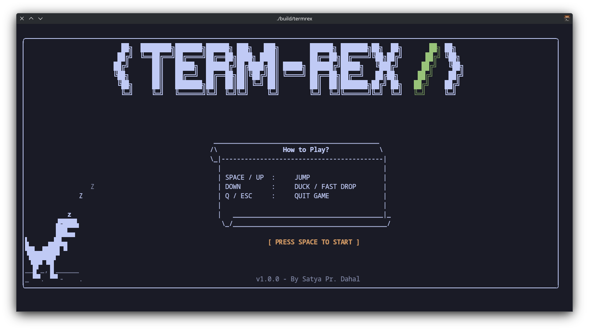

# \<TERM-REX/\>
`termrex` is a terminal-based endless runner game inspired by the Chrome Dino offline game. Jump or duck to avoid obstacles while running endlessly in your terminal. It works on **POSIX-like terminals**, including **Linux virtual consoles**.

---

## Requirements

- POSIX-compatible terminal / console(Linux,MacOs,BSD)
- g++ or clang++ 
- GNU Make

## Quick Start

```sh
git clone https://github.com/SATYADAHAL/termrex.git
cd termrex
make -j release
./build/termrex
```

---

## Usage

```text
Usage:
    termrex [options]

Options:
    -h, --help               Show help menu
    -v, --version            Show game version
    --ascii-only             Use ASCII characters only
    --unicode                Use Unicode characters (default)
    --no-obstacle-dino       Disable flying dinosaur obstacles and ducking (no need for --keyrepeat)
    --keyrepeat <ms>         Set key repeat delay (default 200ms)
    --skip-intro             Skip the intro screen and start game immediately
```

**Example:**

```sh
./build/termrex --keyrepeat 500 --skip-intro
```


---

## Notes

* Most terminals don’t send key release events, which is why `--keyrepeat` is used to ensure smooth input.
* Default `termrex` key repeat is 200 ms, but here are some typical defaults by OS/desktop environment:

| OS / DE            | Approx. Key Repeat Delay |
| ------------------ | ------------------------ |
| macOS              | 180-225 ms               |
| Linux (X11 Base)   | 660 ms                   |
| Linux (GNOME)      | 500 ms                   |
| Linux (KDE Plasma) | ~500 ms                  |

Better check for your OS/DE from keyboard settings/google.
* Terminals supporting the [Kitty Keyboard Protocol Spec](https://sw.kovidgoyal.net/kitty/keyboard-protocol/)
 (Kitty, Alacritty, WezTerm, Foot, Ghostty, iTerm2, Rio) handle key repeat automatically, so you don’t need to adjust `--keyrepeat`.
* Using `--no-obstacle-dino` disables flying obstacles and ducking, and also removes the need for `--keyrepeat`.


## Screenshots


---

## GamePlay
[demo.webm](https://github.com/user-attachments/assets/c5068d15-5257-4828-8192-94e8fe1ec189)


---

## Install (optional)

```sh
sudo make install
```

Installs `termrex` to `/usr/local/bin`.

---

## License

MIT License. See the [LICENSE](LICENSE) file.
